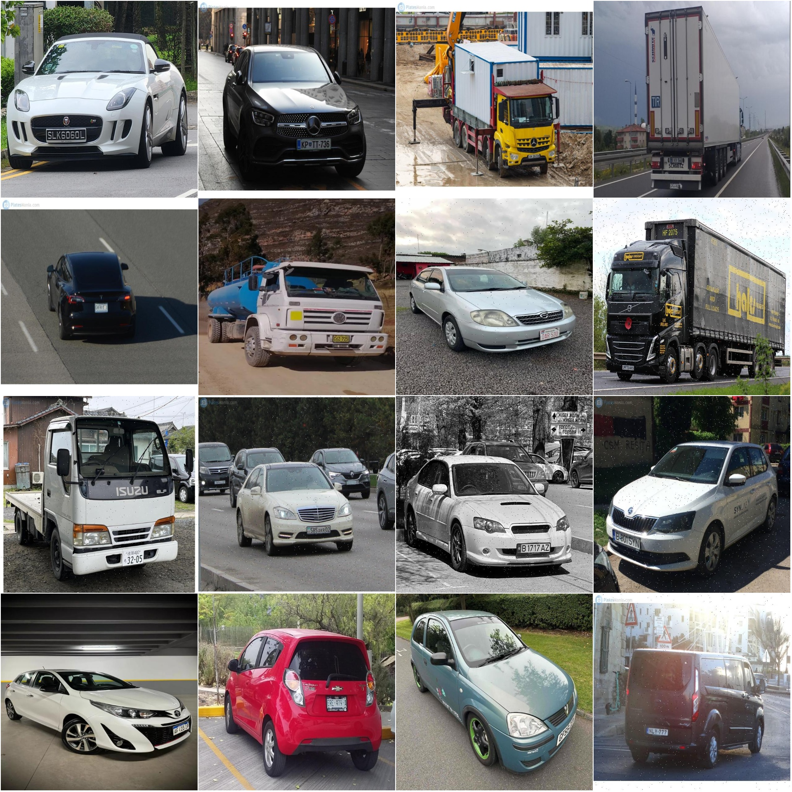
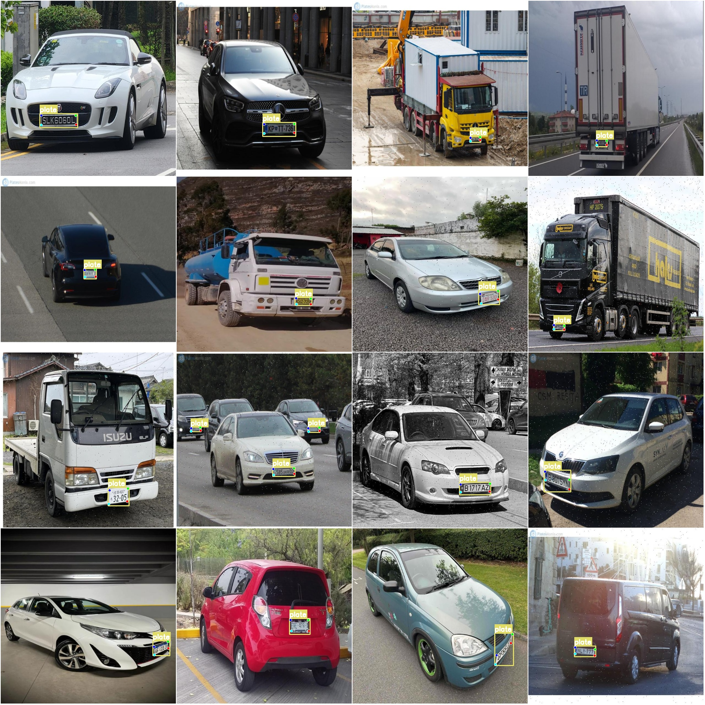

# Vehicle License Plate Keypoint Detection Dataset COCO+YOLO Format: 16,733 Images in 1 Classification with 4 Keypoints

Please note that half of the dataset contains augmented images; details can be found in the images.
Dataset format: YOLO keypoint format (Note this is not the target detection or segmentation YOLO format, it merely includes JPG images and corresponding yolo format TXT files).
Number of images (number of JPG files): 16,733
Number of annotations (number of TXT files): 16,733
Training set size: 13,780
Validation set size: 2,953
Test set size: 0
Number of annotation categories: 1
Annotation category name: ['plate']
Number of keypoint names: ["new-point-0", "new-point-1", "new-point-2", "new-point-3"]
Each category annotation box count:
'plate' box count=20,208
Total box count=20,208
Image resolution: 640x640
Important Notice: The dataset has been well-divided into training, validation, and test sets, which can be directly used for training models like yolov5-pose, yolov8-pose, yolov11-pose, or 
yolov26-pose.
Special Disclaimer: This dataset does not guarantee the accuracy of the trained model or the weight file.
Image preview:
Annotation examples:
Randomly selected 16 images from the dataset:
Annotation drawing result:

## Images

Here is a pay link on Stripe ( https://buy.stripe.com/3cs8yP7sY87d0vu9AB ). Please contact me lonlonago@foxmail.com after funding $89, and I will send you a complete data files , thank you!

